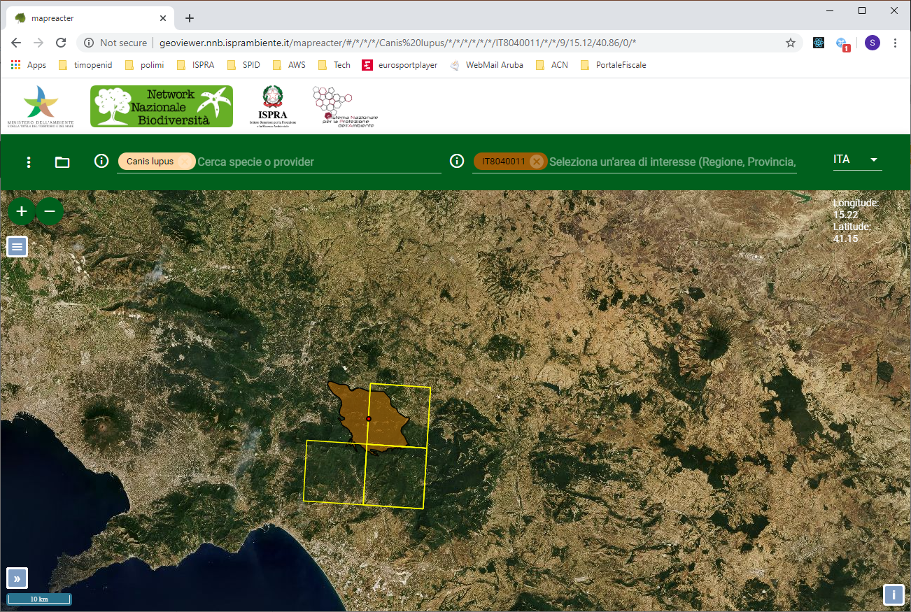

The system allows the visualization on the map of the observations and distributions for the order, the family, the genus or the selected species.

## Filters:

Filters (such as order, family, genus or species view) can be passed via url or via the [taxonomy search] (doc_search.md).

## Here are some example urls:

```
http://193.206.192.107/mapreacter/#/Chordeumatida
http://193.206.192.107/mapreacter/#/*/Chordodidae
http://193.206.192.107/mapreacter/#/*/*/Chordodes
http://193.206.192.107/mapreacter/#/*/*/*/Smicromyrme ruficollis ruficollis
```


