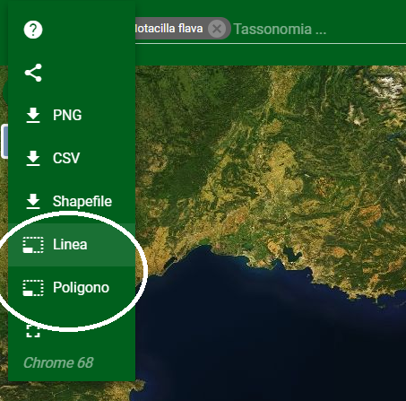
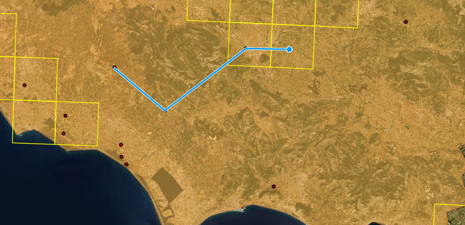

This feature allows you to measure the distance between two or more points or the area of a polygon.

The measurement result is displayed at the top left and is updated in real time.

To select the first point and the intermediate points of the measurement, a click is necessary while a double click is required to complete the measurement.

