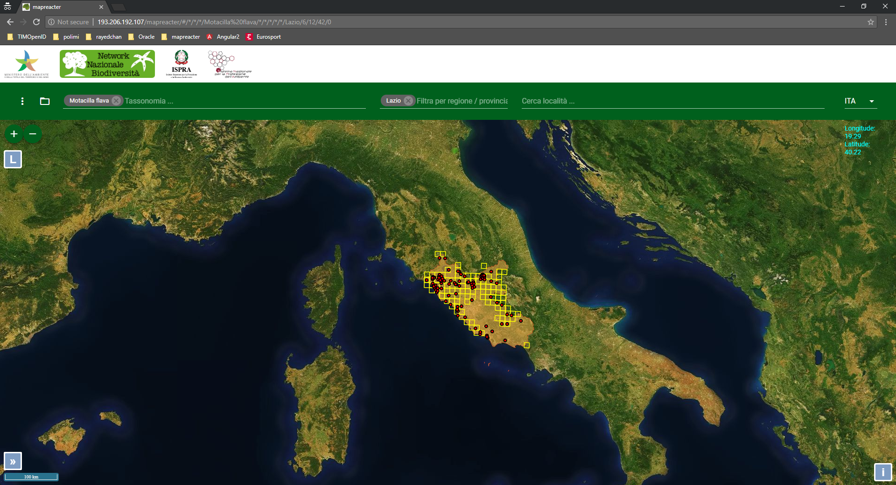

This filter allows to limit to the selected region / province the visualization on the map of the observations and the distributions for the chosen taxonomy.

## Example

In the following case, the "Motacilla flava" species is shown only for Lazio.

