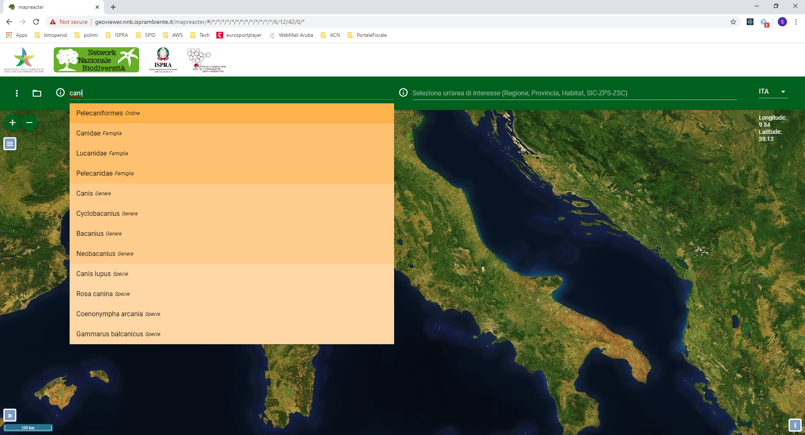

## Taxonomy search

The system allows to perform a LIKE search, this means that all the orders, families, genus and species containing the set string are returned.
After choosing one of the returned elements, the system shows on map the observations and distributions.

It is possible to set up two searches at the same time, and then for example to visualize on the map a species and its predator.

Note: If a third choice is inserted, it replaces the first one.