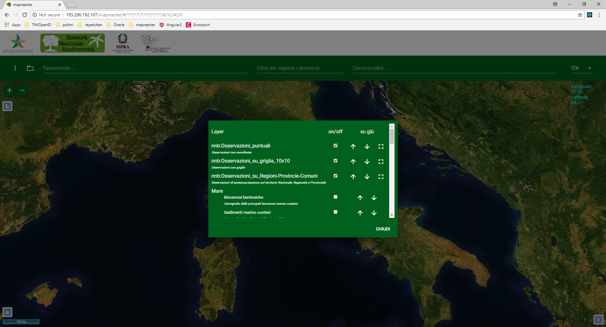

## Table of Content

This section allows to view the list of layers.

For each of these the following actions are possible:

## on/off

With these buttons the selected layer can be switched on or off.

## up / down

Through these buttons the selected layer can be brought up or down on the visibility scale.

## Fit Extent

This function allows you to reset the map size based on the content of the selected layer.
